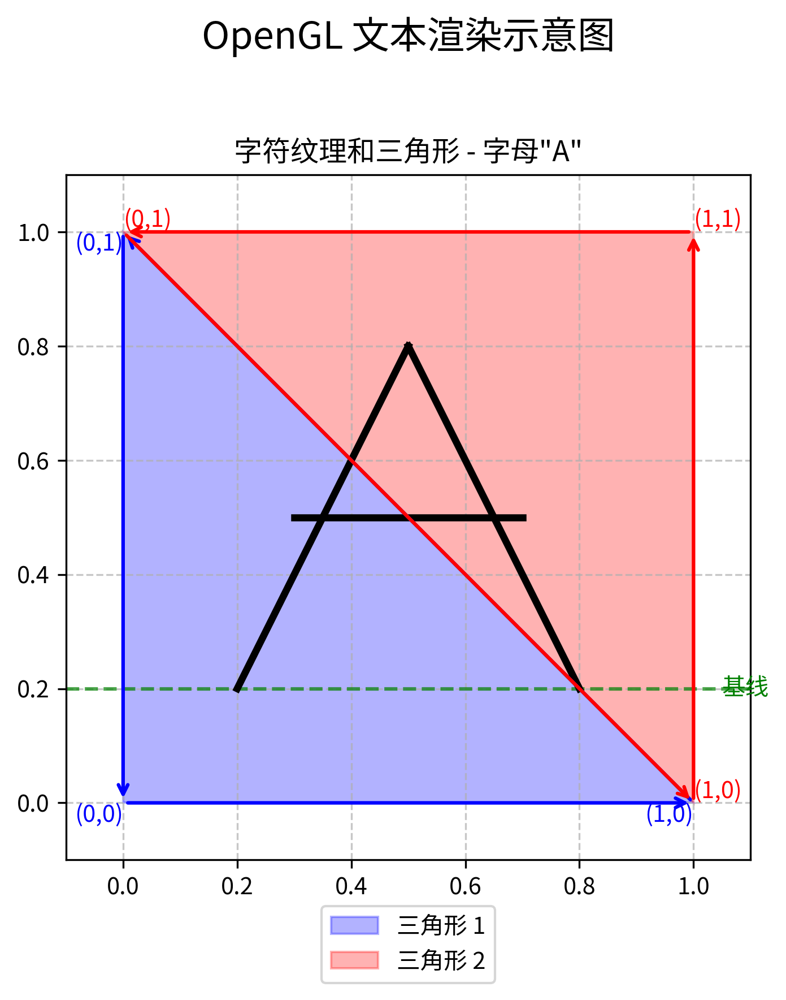

# OpenGL/GLFW 中的 FreeType 文本渲染技术

本来想找个软柿子，说什么Hello World，结果发现GLFW的Hello World都这么复杂，但是，来都来了，还是从文本渲染开始吧。

首先，我们需要一点五彩斑斓的黑色，使得界面一看就很醒目！就比如这样的！


实际上，在使用OpenGL时，我们通常会需要一堆东西，比如GLEW或者GLAD，来帮助我们加载OpenGL的函数；GLFW，来帮助我们创建窗口和上下文；FreeType，来帮助我们渲染字体。

## GLFW 库介绍

GLFW 是一个用于 OpenGL 开发的轻量级工具库，专注于处理窗口、上下文和输入。它为 OpenGL 应用程序提供了一个简单的 API，用于创建窗口、上下文和处理用户输入。

### 主要功能

- **窗口和上下文管理**：创建和管理 OpenGL 上下文和窗口
- **输入处理**：键盘、鼠标、游戏手柄和时间输入
- **事件处理**：窗口、输入和时间事件的回调机制
- **多显示器支持**：处理多个显示器的分辨率和位置

### API 结构

GLFW 的 API 按功能分为几个主要类别：

1. **初始化和终止**：
   - `glfwInit()` - 初始化 GLFW 库
   - `glfwTerminate()` - 终止 GLFW 库并释放资源

2. **窗口和上下文**：
   - `glfwCreateWindow()` - 创建窗口和 OpenGL 上下文
   - `glfwMakeContextCurrent()` - 将上下文设为当前
   - `glfwSwapBuffers()` - 交换前后缓冲区

3. **输入处理**：
   - `glfwGetKey()` - 获取键盘按键状态
   - `glfwGetMouseButton()` - 获取鼠标按钮状态
   - `glfwGetCursorPos()` - 获取光标位置

4. **事件处理**：
   - `glfwSetKeyCallback()` - 设置键盘事件回调
   - `glfwSetMouseButtonCallback()` - 设置鼠标按钮事件回调
   - `glfwSetCursorPosCallback()` - 设置光标位置事件回调

5. **时间**：
   - `glfwGetTime()` - 获取自初始化以来经过的时间
   - `glfwSetTime()` - 设置计时器的值

### 官方文档和资源

- [GLFW 官方网站](https://www.glfw.org/)
- [GLFW 文档](https://www.glfw.org/docs/latest/)
- [GLFW GitHub 仓库](https://github.com/glfw/glfw)
- [GLFW 指南](https://www.glfw.org/docs/latest/quick.html)

GLFW 的设计理念是提供一个简单、现代且跨平台的库，专注于 OpenGL 应用程序最基本的需求，而不是提供完整的应用程序框架。这使得它非常适合与其他库（如 FreeType）结合使用，构建完整的 OpenGL 应用程序。

### 我们程序的 GLFW 实现

```c
int main(void) {
    /* 初始化 GLFW */
    if (!glfwInit()) {
        fprintf(stderr, "Failed to initialize GLFW\n");
        return -1;
    }

    /* 设置 OpenGL 版本为 3.3 Core Profile */
    glfwWindowHint(GLFW_CONTEXT_VERSION_MAJOR, 3);
    glfwWindowHint(GLFW_CONTEXT_VERSION_MINOR, 3);
    glfwWindowHint(GLFW_OPENGL_PROFILE, GLFW_OPENGL_CORE_PROFILE);
#ifdef __APPLE__
    glfwWindowHint(GLFW_OPENGL_FORWARD_COMPAT, GL_TRUE);
#endif

    /* 创建窗口 */
    GLFWwindow* window = glfwCreateWindow(WIDTH, HEIGHT, "OpenGL Text Rendering", NULL, NULL);
    if (!window) {
        fprintf(stderr, "Failed to create GLFW window\n");
        glfwTerminate();
        return -1;
    }

    /* 设置当前上下文 */
    glfwMakeContextCurrent(window);

    /* 初始化 GLEW */
    if (glewInit() != GLEW_OK) {
        fprintf(stderr, "Failed to initialize GLEW\n");
        return -1;
    }

    /* 设置视口 */
    glViewport(0, 0, WIDTH, HEIGHT);

    /* 主循环 */
    while (!glfwWindowShouldClose(window)) {
        /* 处理输入 */
        if (glfwGetKey(window, GLFW_KEY_ESCAPE) == GLFW_PRESS)
            glfwSetWindowShouldClose(window, GL_TRUE);

        /* 渲染 */
        glClearColor(0.2f, 0.3f, 0.3f, 1.0f);
        glClear(GL_COLOR_BUFFER_BIT);

        /* 交换缓冲区并处理事件 */
        glfwSwapBuffers(window);
        glfwPollEvents();
    }

    /* 清理资源并退出 */
    glfwTerminate();
    return 0;
}
```

上述代码展示了一个基本的 OpenGL 应用程序框架，主要包含以下步骤：

1. **OpenGL 配置**
   - 设置 OpenGL 版本为 3.3 Core Profile
   - 为 macOS 设置特殊的兼容性标志

2. **窗口创建与初始化**
   - 使用 GLFW 创建一个 800x600 的窗口
   - 设置窗口标题为 "OpenGL Text Rendering"
   - 初始化 OpenGL 上下文
   - 初始化 GLEW 扩展加载库

3. **视口设置**
   - 将视口设置为与窗口大小相同

4. **主循环实现**
   - 实现基本的事件循环
   - 处理 ESC 键退出
   - 使用深青色 (0.2, 0.3, 0.3) 作为清屏颜色
   - 实现双缓冲交换和事件轮询

5. **资源清理**
   - 程序结束时正确终止 GLFW

这个框架为后续实现文本渲染提供了必要的基础设施，包括 OpenGL 上下文、窗口系统和基本的渲染循环。

## 文本渲染的基本原理

本文档详细解释 FreeType 如何在 OpenGL 中实现高质量文本渲染，重点关注核心技术、坐标系统和实现方法。

### FreeType 简介

FreeType 是一个专门用于字体处理的软件库，它提供了统一的 API 来访问不同格式的字体文件。在 OpenGL 应用程序中，FreeType 解决了以下关键问题：

- 从字体文件中加载字形（字符的图形表示）
- 将矢量字形转换为位图
- 提供精确的字形度量信息，用于正确定位

主要特点：

- 支持多种字体格式（TTF、OTF、WOFF 等）
- 高质量的字形光栅化
- 提供完整的字符度量信息
- 支持 Unicode 和国际化文本

在 OpenGL 中渲染文本的基本思路是：

1. 使用 FreeType 将每个字符渲染为纹理
2. 创建包含这些纹理的四边形（通常是两个三角形）
3. 根据排版规则正确定位这些四边形
4. 使用片段着色器渲染文本

## 坐标系统与度量

理解 FreeType 和 OpenGL 的坐标系统是正确渲染文本的关键。

### FreeType 坐标系统

FreeType 使用以下度量信息来描述字形：

- **宽度 (Width)**: 字形位图的宽度
- **高度 (Height)**: 字形位图的高度
- **前进值 (Advance)**: 渲染此字符后光标应前进的水平距离（以 1/64 像素为单位）
- **左侧轴承 (Left/Bearing X)**: 从当前光标位置到字形左边缘的水平距离
- **顶部轴承 (Top/Bearing Y)**: 从基线到字形顶部的垂直距离

### OpenGL 坐标系统

在我们的实现中，使用了正交投影矩阵将 OpenGL 的坐标系统映射到屏幕坐标：

```c
GLfloat projection[16] = {
    2.0f / WIDTH, 0.0f, 0.0f, 0.0f,
    0.0f, 2.0f / HEIGHT, 0.0f, 0.0f,
    0.0f, 0.0f, -1.0f, 0.0f,
    -1.0f, -1.0f, 0.0f, 1.0f
};
```

这个矩阵将窗口左上角映射为 (-1, 1)，右下角映射为 (1, -1)。这意味着在我们的系统中：

- X 轴从左到右（与 FreeType 一致）
- Y 轴从上到下（与 FreeType 的基线系统不同）

## 字符数据结构

为了高效渲染文本，我们定义了一个存储字符信息的结构：

```c
typedef struct {
    GLuint TextureID;   /* 字形纹理的 ID */
    int Width;          /* 字形宽度 */
    int Height;         /* 字形高度 */
    int Advance;        /* 前进值（水平偏移量，1/64 像素单位） */
    int Left;           /* 左侧轴承（水平偏移） */
    int Top;            /* 顶部轴承（垂直偏移） */
} Character;
```

这些字段直接对应 FreeType 提供的度量信息，是正确渲染文本的关键。

## 初始化 FreeType 和加载字体

```c
void initFreeType(void) {
    FT_Library ft;
    if (FT_Init_FreeType(&ft)) {
        fprintf(stderr, "错误: 无法初始化 FreeType 库\n");
        exit(1);
    }
    
    FT_Face face;
    /* 尝试加载字体文件 */
    if (FT_New_Face(ft, "fonts/arial.ttf", 0, &face)) {
        fprintf(stderr, "错误: 无法加载字体\n");
        exit(1);
    }
    
    /* 设置字体大小 */
    FT_Set_Pixel_Sizes(face, 0, 48);
    
    /* 禁用字节对齐限制 */
    glPixelStorei(GL_UNPACK_ALIGNMENT, 1);
    
    /* 加载 ASCII 字符集 */
    for (unsigned char c = 0; c < 128; c++) {
        /* 加载字符字形 */
        if (FT_Load_Char(face, c, FT_LOAD_RENDER)) {
            continue;
        }
        
        /* 生成纹理 */
        GLuint texture;
        glGenTextures(1, &texture);
        glBindTexture(GL_TEXTURE_2D, texture);
        glTexImage2D(
            GL_TEXTURE_2D,
            0,
            GL_RED,
            face->glyph->bitmap.width,
            face->glyph->bitmap.rows,
            0,
            GL_RED,
            GL_UNSIGNED_BYTE,
            face->glyph->bitmap.buffer
        );
        
        /* 设置纹理选项 */
        glTexParameteri(GL_TEXTURE_2D, GL_TEXTURE_WRAP_S, GL_CLAMP_TO_EDGE);
        glTexParameteri(GL_TEXTURE_2D, GL_TEXTURE_WRAP_T, GL_CLAMP_TO_EDGE);
        glTexParameteri(GL_TEXTURE_2D, GL_TEXTURE_MIN_FILTER, GL_LINEAR);
        glTexParameteri(GL_TEXTURE_2D, GL_TEXTURE_MAG_FILTER, GL_LINEAR);
        
        /* 存储字符信息 */
        Character character = {
            texture,
            face->glyph->bitmap.width,
            face->glyph->bitmap.rows,
            face->glyph->advance.x,
            face->glyph->bitmap_left,
            face->glyph->bitmap_top
        };
        Characters[c] = character;
    }
    
    /* 清理 FreeType 资源 */
    FT_Done_Face(face);
    FT_Done_FreeType(ft);
}
```

这段代码完成了以下工作：

1. 初始化 FreeType 库
2. 加载字体文件
3. 设置字体大小
4. 为每个 ASCII 字符生成纹理
5. 存储每个字符的度量信息

## 文本渲染的核心函数

```c
void renderText(const char* text, float x, float y, float scale, float r, float g, float b) {
    glUseProgram(shaderProgram);
    GLint colorLoc = glGetUniformLocation(shaderProgram, "textColor");
    glUniform3f(colorLoc, r/255.0f, g/255.0f, b/255.0f);
    glActiveTexture(GL_TEXTURE0);
    glBindVertexArray(VAO);
    
    for (const char* c = text; *c; c++) {
        Character ch = Characters[*c];
        
        // 计算位置 - 基线对齐
        float xpos = x + ch.Left * scale;
        
        // 注意：在我们的坐标系统中，y 轴是从上到下的
        // ch.Top 是从基线到字形顶部的距离
        float ypos = y - (ch.Height - ch.Top) * scale;
        
        float w = ch.Width * scale;
        float h = ch.Height * scale;
        
        // 更新顶点数据 - 注意 Y 坐标的顺序
        float vertices[6][4] = {
            { xpos,     ypos + h,   0.0f, 0.0f },  // 左下 (纹理坐标 0,0)
            { xpos,     ypos,       0.0f, 1.0f },  // 左上 (纹理坐标 0,1)
            { xpos + w, ypos,       1.0f, 1.0f },  // 右上 (纹理坐标 1,1)
            
            { xpos,     ypos + h,   0.0f, 0.0f },  // 左下 (纹理坐标 0,0)
            { xpos + w, ypos,       1.0f, 1.0f },  // 右上 (纹理坐标 1,1)
            { xpos + w, ypos + h,   1.0f, 0.0f }   // 右下 (纹理坐标 1,0)
        };
        
        glBindTexture(GL_TEXTURE_2D, ch.TextureID);
        glBindBuffer(GL_ARRAY_BUFFER, VBO);
        glBufferSubData(GL_ARRAY_BUFFER, 0, sizeof(vertices), vertices);
        glBindBuffer(GL_ARRAY_BUFFER, 0);
        glDrawArrays(GL_TRIANGLES, 0, 6);
        
        x += (ch.Advance >> 6) * scale;
    }
    
    glBindVertexArray(0);
    glBindTexture(GL_TEXTURE_2D, 0);
}
```

这个函数是文本渲染的核心，它完成以下工作：

1. 设置着色器和颜色
2. 遍历文本中的每个字符
3. 根据字符度量信息计算正确的位置
4. 创建包含纹理坐标的顶点数据
5. 渲染每个字符的纹理四边形
6. 根据字符的前进值移动光标

所以，实际上OpenGL的文字是一个用文字纹理渲染的矩形（两个三角形拼起来的）……真是离谱。

## OpenGL 顶点描述与顺序

在 OpenGL 中，文本渲染是通过将字符纹理映射到由两个三角形组成的矩形上实现的。下面详细解释顶点数据的结构和顺序：

### 顶点数据结构

在 OpenGL 中，每个顶点通常包含多个属性，如位置坐标、纹理坐标、法线等。在文本渲染代码中，每个顶点包含 4 个浮点数：

```c
float vertices[6][4] = { ... }
```

每个顶点的 4 个值表示：

1. `xpos` - 顶点的 X 坐标
2. `ypos` - 顶点的 Y 坐标
3. `0.0f` 或 `1.0f` - 纹理坐标的 U 值（水平方向）
4. `0.0f` 或 `1.0f` - 纹理坐标的 V 值（垂直方向）

### 顶点顺序与三角形

代码定义了两个三角形，共 6 个顶点（每个三角形 3 个顶点）。在 OpenGL 中，三角形的顶点顺序非常重要，它决定了三角形的正面和背面，以及纹理如何映射到三角形上。

#### 第一个三角形

```c
{ xpos,     ypos + h,   0.0f, 0.0f },  // 左下 (纹理坐标 0,0)
{ xpos,     ypos,       0.0f, 1.0f },  // 左上 (纹理坐标 0,1)
{ xpos + w, ypos,       1.0f, 1.0f },  // 右上 (纹理坐标 1,1)
```

这三个顶点按逆时针顺序排列，形成第一个三角形：

1. 左下角：位置 (xpos, ypos+h)，纹理坐标 (0,0)
2. 左上角：位置 (xpos, ypos)，纹理坐标 (0,1)
3. 右上角：位置 (xpos+w, ypos)，纹理坐标 (1,1)

#### 第二个三角形

```c
{ xpos,     ypos + h,   0.0f, 0.0f },  // 左下 (纹理坐标 0,0)
{ xpos + w, ypos,       1.0f, 1.0f },  // 右上 (纹理坐标 1,1)
{ xpos + w, ypos + h,   1.0f, 0.0f }   // 右下 (纹理坐标 1,0)
```

这三个顶点按逆时针顺序排列，形成第二个三角形：

1. 左下角：位置 (xpos, ypos+h)，纹理坐标 (0,0)
2. 右上角：位置 (xpos+w, ypos)，纹理坐标 (1,1)
3. 右下角：位置 (xpos+w, ypos+h)，纹理坐标 (1,0)

### 纹理坐标映射

纹理坐标 (U,V) 的范围是 0.0 到 1.0，表示纹理图像上的相对位置：

- U=0.0 表示纹理的左边缘，U=1.0 表示纹理的右边缘
- V=0.0 表示纹理的底部，V=1.0 表示纹理的顶部

在这个例子中，纹理坐标被映射到字符纹理上，使得字符能够正确地显示在四边形上。

### 顶点顺序的重要性

1. **面剔除**：OpenGL 默认会剔除背面（顺时针顺序的三角形），只渲染正面（逆时针顺序的三角形）。这有助于提高渲染性能。

2. **纹理映射**：顶点顺序决定了纹理如何映射到三角形上。正确的顶点顺序确保纹理不会扭曲或翻转。

3. **共享顶点**：注意第一个三角形的最后一个顶点和第二个三角形的第二个顶点是相同的，这样可以减少顶点数据的冗余。

### 示意图



上图展示了 OpenGL 如何通过两个三角形和纹理坐标来渲染文本字符。字母 "A" 被绘制在由两个三角形组成的矩形中间，箭头表示顶点的顺序。

## 彩虹文本渲染

我们的实现还支持彩虹文本渲染，为每个字符分配不同的鲜艳颜色：

```c
// 是否使用彩虹模式（每个字符不同颜色）
int rainbowMode = (r < 0 || g < 0 || b < 0);

// 为彩虹模式生成鲜艳颜色的种子
srand(time(NULL));

for (const char* c = text; *c; c++) {
    Character ch = Characters[*c];
    
    // 如果是彩虹模式，为每个字符生成鲜艳的随机颜色
    if (rainbowMode) {
        // 生成鲜艳的颜色 - 确保至少一个通道接近最大值
        float bright_r, bright_g, bright_b;
        
        // 确保颜色鲜艳的策略：
        // 1. 随机选择一个通道接近最大值 (0.8-1.0)
        // 2. 其他通道随机但较低，确保对比度
        int primary = rand() % 3; // 随机选择一个主通道
        
        if (primary == 0) {
            bright_r = 0.8f + (rand() % 20) / 100.0f; // 0.8-1.0
            bright_g = (rand() % 60) / 100.0f;        // 0.0-0.6
            bright_b = (rand() % 60) / 100.0f;        // 0.0-0.6
        } else if (primary == 1) {
            bright_r = (rand() % 60) / 100.0f;        // 0.0-0.6
            bright_g = 0.8f + (rand() % 20) / 100.0f; // 0.8-1.0
            bright_b = (rand() % 60) / 100.0f;        // 0.0-0.6
        } else {
            bright_r = (rand() % 60) / 100.0f;        // 0.0-0.6
            bright_g = (rand() % 60) / 100.0f;        // 0.0-0.6
            bright_b = 0.8f + (rand() % 20) / 100.0f; // 0.8-1.0
        }
        
        glUniform3f(colorLoc, bright_r, bright_g, bright_b);
    } else {
        // 使用传入的统一颜色
        glUniform3f(colorLoc, r/255.0f, g/255.0f, b/255.0f);
    }
    
    // 渲染字符...
}
```

彩虹模式的关键是为每个字符生成不同的鲜艳颜色。我们的算法确保每个颜色都有一个主通道接近最大值，而其他通道较低，这样可以产生鲜艳的对比效果。

## 文本定位的数学原理

### 水平定位

水平定位的计算公式为：

```c
x_{pos} = x + (ch.Left * scale)
```

其中：

- `x` 是当前光标位置
- `ch.Left` 是水平轴承（从光标到字形左边缘的距离）
- `scale` 是缩放因子

渲染后，光标前进的距离为：

```c
x_{advance} = (ch.Advance >> 6) * scale
```

位移操作 $\gg 6$ 是将 1/64 像素单位转换为整数像素（因为 FreeType 存储前进值时使用 1/64 像素为单位）。

### 垂直定位

垂直定位是文本渲染中最复杂的部分，特别是当我们需要处理不同的对齐方式时。

在我们当前的实现中，我们使用以下公式来计算垂直位置：

```c
y_{pos} = y - (ch.Height - ch.Top) * scale

```

这个公式的含义是：

- `y` 是基线位置
- `ch.Height` 是字形的总高度
- `ch.Top` 是从基线到字形顶部的距离
- `(ch.Height - ch.Top)` 计算的是从基线到字形底部的距离

通过这个公式，我们将字符放置在基线上，并确保字符的底部对齐。

### 坐标系统转换

由于 OpenGL 和 FreeType 使用不同的坐标系统，我们需要进行适当的转换：

1. FreeType 中，Y 轴向上为正，基线是字符对齐的参考线
2. 在我们的 OpenGL 设置中，Y 轴向下为正（由于我们的投影矩阵）

因此，我们的垂直定位公式需要考虑这种坐标系统的差异。

## 在窗口中居中显示文本

要将文本居中显示在窗口中，需要计算文本的总宽度，然后调整起始位置：

```c
/* 渲染居中文本 */
const char* text = "Hello World!";
float scale = 1.5f;

/* 计算文本总宽度 */
float textWidth = 0.0f;
for (const char* c = text; *c; c++) {
    textWidth += (Characters[*c].Advance >> 6) * scale;
}

/* 计算水平居中位置 */
float x = (WIDTH - textWidth) / 2.0f;

/* 计算垂直居中位置（基线位置） */
float y = HEIGHT / 2.0f;

/* 渲染文本 */
renderText(text, x, y, scale, 255, 215, 0);  // 金色
```

这段代码实现了：

1. 计算文本的总宽度：`textWidth = \sum_{for ch \in text} (ch.Advance >> 6) * scale`
2. 计算水平居中的起始 x 坐标：`x = (WIDTH - textWidth) / 2.0`
3. 设置基线的 y 坐标在窗口中间：`y = HEIGHT / 2.0`
4. 使用金色渲染文本

## 着色器实现

文本渲染需要特殊的着色器来处理字形纹理：

```glsl
// 顶点着色器
#version 330 core
layout (location = 0) in vec4 vertex;
out vec2 TexCoords;
uniform mat4 projection;

void main() {
    gl_Position = projection * vec4(vertex.xy, 0.0, 1.0);
    TexCoords = vertex.zw;
}

// 片段着色器
#version 330 core
in vec2 TexCoords;
out vec4 color;
uniform sampler2D text;
uniform vec3 textColor;

void main() {
    vec4 sampled = vec4(1.0, 1.0, 1.0, texture(text, TexCoords).r);
    color = vec4(textColor, 1.0) * sampled;
}
```

这对着色器的特点：

1. 顶点着色器将纹理坐标传递给片段着色器
2. 片段着色器从单通道纹理中采样 alpha 值
3. 将 alpha 值与指定的文本颜色结合

片段着色器中的关键公式是：

```c
color = vec4(textColor, 1.0) * sampled
```

其中 `sampled` 是从字形纹理中采样的值，它的 alpha 通道决定了文本的形状。

## 不同对齐方式的实现

虽然我们当前的实现使用了底部对齐，但也可以实现其他对齐方式：

### 基线对齐（传统）

```c
float ypos = y - ch.Top * scale;
```

### 顶部对齐

```c
// 找出最高字符
int maxHeight = 0;
for (const char* p = text; *p; p++) {
    if (Characters[*p].Height > maxHeight)
        maxHeight = Characters[*p].Height;
}

// 对齐顶部
float ypos = y + (maxHeight - ch.Height) * scale;
```

### 中心对齐

```c
float charCenterY = ch.Height / 2.0f;
float ypos = y - (ch.Top - charCenterY) * scale;
```

## 总结

OpenGL 中使用 FreeType 渲染文本的关键步骤：

1. **初始化**：加载字体并为每个字符生成纹理
2. **定位**：使用 FreeType 提供的度量信息正确定位每个字符
3. **渲染**：为每个字符创建纹理四边形并渲染
4. **布局**：计算文本尺寸以实现居中或其他布局效果

高质量文本渲染的关键在于正确理解和应用 FreeType 提供的字形度量信息，并处理好 OpenGL 和 FreeType 之间的坐标系统差异。通过这种方法，我们可以在 OpenGL 应用程序中实现清晰、精确的文本显示。

最后，我们还整一个一样的中文！


