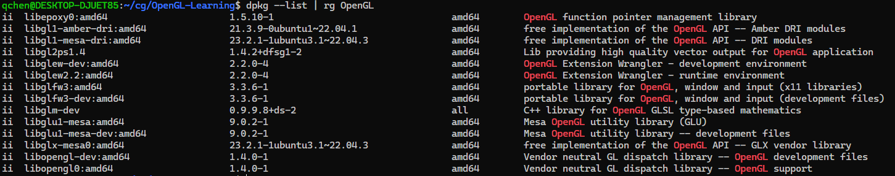

# C/Cpp开发OpenGL程序所需要的亿点点基础

- [Table of Contents](./README.md)
- [Repository](<https://github.com/qchen-fdii-carc/OpenGL-Learning>)

## All you need to start OpenGL programming


其实，要搞点非常落后无聊的OpenGL编程，所需要就只有一台可以运行windows的电脑。

然后按照下面的步骤：

1. 安装WSL，参考[WSL安装教程](<https://docs.microsoft.com/en-us/windows/wsl/install>)
2. 然后就是Linux程序开发的那一套完整、可爱、干净、简单、优雅的流程。

值得注意的是，微软提示：你只能在Windows 10 version 2004 and higher (Build 19041 and higher) or Windows 11上安装WSL。

还有一点需要记得的就是：别管别人怎么吹WSL 1，说什么WSL 1才是XXX的本意，WSL 2已经走上了邪道，什么xxx性能，什么xxx，你就直接装WSL 2。

安装的时候，提示你设置一个密码，记得设简单一点，这虽然就是你的所谓root密码，你都用windows了就不要在意这个，最好就是123456。后面`sudo`命令需要用到这个密码。

一旦安装完WSL 2，能够运行wsl，出来一个黑框框，就算是成功了。

## LINUX开发环境配置

一般而言，Linux的发行版都自带GCC，所以不需要额外安装。但是还有一些用于开发的基础工具，通常会需要安装一下。

```bash
sudo apt update && sudo apt install build-essential
```

记得，这个命令是在黑乎乎的wsl窗口中执行的，所以，你得先打开一个黑乎乎的wsl窗口。上面命令中的`sudo`，就是让你以root用户执行命令，所以，你得先输入你设置的密码。其实这句话是两个命令，`sudo apt update`是更新软件源，`sudo apt install build-essential`是安装基础工具。中间的`&&`，表示如果前面的命令执行成功，则执行后面的命令。

那么这到底安装了些什么呢？记得，在Linux下面，所有东西都是透明的。

我们调用`build-essential`安装的一个包来看看：

```bash
dpkg -L build-essential
/.
/usr
/usr/share
/usr/share/build-essential
/usr/share/build-essential/essential-packages-list
/usr/share/build-essential/list
/usr/share/doc
/usr/share/doc/build-essential
/usr/share/doc/build-essential/AUTHORS
/usr/share/doc/build-essential/changelog.gz
/usr/share/doc/build-essential/copyright
/usr/share/doc/build-essential/essential-packages-list
/usr/share/doc/build-essential/list
```

这就列出了`build-essential`包的安装路径和涉及到的所有文件。很明显，我们可考虑看看这些文件都是些什么。

```bash
cat /usr/share/build-essential/essential-packages-list
```

或者，如果你还敢冒险挑战自己，可以试试：

```bash
vi /usr/share/build-essential/essential-packages-list
```

这可能导致你永远的失去你的wsl窗口，所以，还是不要轻易尝试。（提示输入多个ESC，然后输入`:q!`，然后回车，出了任何事情，不要告诉别人你看过我的贴子）

```
This list was generated on Sun 03 Jan 2021 11:30:56 AM CET for amd64
It contains a list of essential packages (which are also build-essential).

base-files
base-passwd
bash
bsdutils
coreutils
dash
debianutils
diffutils
dpkg
findutils
grep
gzip
hostname
init-system-helpers
libc-bin
login
ncurses-base
ncurses-bin
perl-base
sed
sysvinit-utils
tar
util-linux
```

这个列表就是`build-essential`包安装的包。你还可以注意的试验上面的`dpkg -L`命令，看看其他包的安装路径和涉及到的所有文件。或者可以实施Linux的两个帮助命令：`man`和`info`。这两玩意在一个方面有一点点一致性，打开一个`man`页面后，按`q`退出，按`h`获取帮助。打开一个`info`页面后，按`q`退出，按`h`获取帮助。其实，知道这两个就已经够了。后面的自己摸索吧，大部分时候，知道怎么推出就已经赢了。

### VSCode 和 Cursor之类

你因为接下来我要搞什么Vim，或者Emacs等高大上的玩意。我又不是原始咳咳原教旨主义者，所以，我推荐你使用VSCode。

安装VSCode，参考[VSCode安装教程](<https://code.visualstudio.com/download>)。

安装Cursor，参考[Cursor安装教程](<https://www.cursor.com/download>)。

现在的这些工具，最后的一点就是，在WSL下面用跟在Windows下面用是一模一样的……感谢SSH，感谢程序员。有了VSCode什么，插件那都是随便整。

### CMake

项目管理，我推荐你使用CMake。依赖管理又是另外一个话题。我为什么要用WSL，因为Linux的依赖管理简直比Windows简单太多了。其实什么`vcpkg`，什么`msbuild`我也不是不会搞，Visual Studio什么也能用。但是用过Linux之后，就再也不想回去了。毕竟，WSL编译的程序，在Windows中一样随便用。

我还没学过CMake。基本上，我只会两个命令和认识一个文件`CMakeLists.txt`。

```bash
cmake -B build
cmake --build build
```

这两个命令都在项目的根目录（就是包含`CMakeLists.txt`的目录）下执行。

然后就可以运行`./build/my-program`了。通常，我连这两个命令都不敲，我直接在VSCode中点击状态栏的那个三角形（就是那个运行按钮，会让你选择运行的目标，如果你的项目中只有一个可执行文件，那么它就会运行这个可执行文件）。

### 依赖管理

Linux，它不是什么正经非IT人员的日常工作操作系统，Linux是一个程序员的操作系统。所以，你得把Linux当作一个整个开发环境，不要拘泥于IDE，不要拘泥于GUI。整个`/`目录，就是你的开发环境。所以，系统的依赖就是你开发的依赖。

大部分我们开发所需要库文件，都可以通过`apt`安装。其实Linux的安装分为了三个层次，底层是`dpkg`，然后是`apt`，然后是`apt-get`。我们按照道理应该用`apt-get`，但是`apt`也没啥问题，偶尔需要用`dpkg`的情况，我其实就只用个`dpkg -L`、`dpkg --list`命令，看看这个库文件安装到哪里了，在哪儿找帮助文件。

随便举个例子，我们要用Dear ImGui，虽然也可以用什么submodule，把源代码弄过来之类的，但是，我们还是用`apt`安装吧。

```bash
sudo apt install libimgui-dev
```

然后，我们可以通过`dpkg -L libimgui-dev`命令，看看这个库文件安装到哪里了。

```bash
dpkg -L libimgui-dev
```

就比如，我们想要看所有安装好的包，可以：

```bash
dpkg --list
```

但是这样太多了，看起来很麻烦，我们推荐装一个工具`rg`，这个工具是`ripgrep`的缩写。

```bash
sudo apt install ripgrep
```

然后，我们就可以：  

```bash
dkpg --list | rg OpenGL
```



所有包含`OpenGL`的包，都会被列出来。并且里面的`OpenGL`，会高亮显示。

这里还有一个最基础的，管道命令，`|`，表示把前面的命令的输出，作为后面命令的输入。这在一些现代化的编程语言中，也有类似的用法， 比如F#的`|>`。

### 命令行的几个无聊碎碎念

从别人的帖子里看到一个命令，先运行一下（！），最好是自己敲一遍，不要复制粘贴，记得不要直接运行命令本身，要运行`命令 --help`，看看这个命令到底能干啥；或者Linux会在你运行命令的时候，告诉你这个命令还没有，在哪个包里面能找到之类的信息。

比如，前面说的`ripgrep`，你运行`rg --help`，就会看到这个命令的用法。如果你没安装，Linux会告诉你，这个命令在`ripgrep`包里面，还亲切地告诉你要用什么命令安装。

记得，不要直接运行别人给你的命令行，除非你知道这个命令行是干啥的。Linux早期形成的文化就是自己多看帮助，别哔哔（这是我个人的理解，并没有得到大家的共识，大家的共识是Linux社区关爱……）

此外就是前面的`man`和`info`命令，用这两个命令来看看Linux这个集成开发环境的某个具体工具是干什么的。

比如，`man ls`，就会看到`ls`命令的帮助。

```bash
man ls
```

记得，按`q`退出，按`h`获取帮助。不要恐慌，Don't Panic，只要带了一条洗澡（擦汗）毛巾，你就能顺利地搭便车畅游银河系。

Linux开发环境的工具，大部分很擅长的事情就是吃进去一堆东西同时拉出来一堆东西，通过`|`管道命令，就可以连成一串吃进去-拉出来-吃进去-拉出来的过程。

### Git

当然，你还得会用Git。

```bash
git clone <repo-url>
```

只要会这个就够了……对于初级的Git用户，就只需要会这个命令。后面如果需要`push`，坑还多着呢……

记得，`git clone`命令，会把你克隆的仓库，放在当前目录下，仓库的名字就是URL中的最后一个斜杠后面的部分。

```bash
git clone https://github.com/qchen-fdii-carc/OpenGL-Learning
```

下面就能看到一个`OpenGL-Learning`的文件夹，里面就是仓库的内容。

```bash
cd OpenGL-Learning
code .
```

就能打开VSCode，并且把当前目录设置为工作目录。

## 具体OpenGL编程

- [ImGui的例子](<https://www.windtunnel.cn/imgui-cubic-example/>)
- [ImGui的例子代码](<https://github.com/qchen-fdii-carc/imgui-cubic-example>)
- [GLFW渲染文本例子](./renderText.md)
- [GLFW渲染文本例子代码](<https://github.com/qchen-fdii-carc/OpenGL-Learning>)

这几个例子的代码，也都是可以直接查看和下载的。

## 最后的碎碎念

Don't Panic!


虽然没啥说服力，我还可以教你一招：

```powershell
wsl --shutdown
```

总是可以把WSL关掉。当然，所有电脑都提供拔电源拆电池的选项，所以，你也可以选择直接关机并且出去进行一些有益身心健康的碳基生物遗传代码传递活动。
